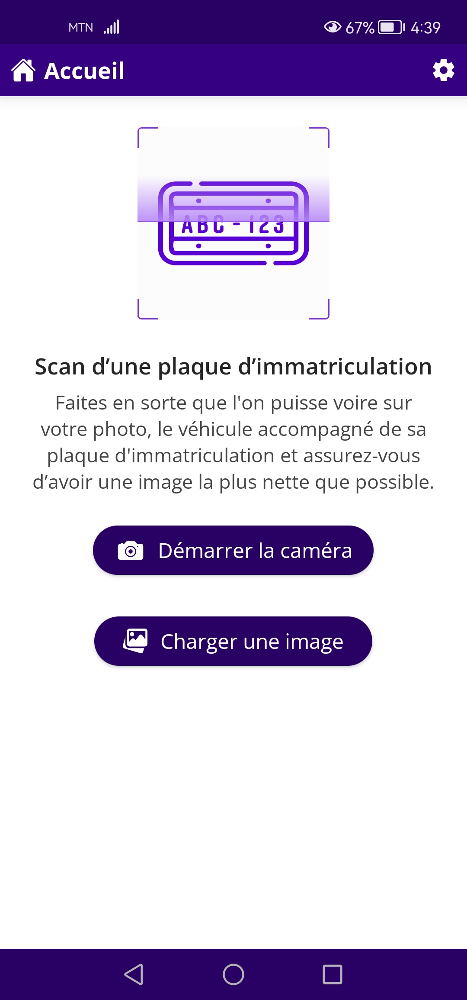
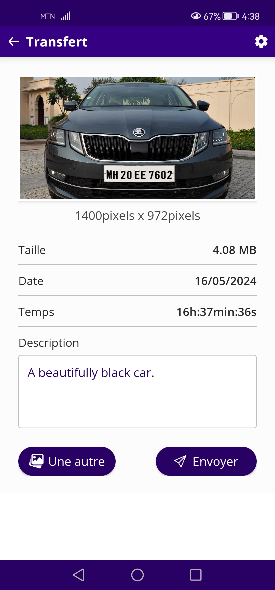

# Number Plate Scanner


Number Plate Scanner has been made to take a capture of a car with his
plate number from device native camera and send it to remote back-end
server for his identification. This mobile application has been built
to make a quick presentation of automobile number plate detection
software.

## Table of contents
1. [Access links](#links)
2. [Reference](#ref)
3. [Final result](#result)
   1. [Screenshots](#images)
4. [Project installation](#install)
    1. [Android Studio installation](#android-install)
    2. [Flutter installation](#flutter-install)
5. [Sources code cloning](#cloning)
6. [Dependencies installation](#dev-install)
7. [Project execution](#running)

## Access links <a id = "links"></a>
The project distribution version can be accessible through the link below :
- https://github.com/LaboDevLogiciel-IA/number_plate_scanner/blob/main/dist/numberplate_scanner_v0.4.0b18.apk

## Reference <a id = "ref"></a>
The project can be found via the link below :
- https://github.com/LaboDevLogiciel-IA/number_plate_scanner

## Final result <a id = "result"></a>
This is the final result of the project :<br/><br/>



## Project installation <a id = "install"></a>
To be able to run this project in development
mode, you will need to install <i>
<a href = "https://developer.android.com">Android Studio</a></i>
and <i><a href = "https://docs.flutter.dev/get-started/install">
Flutter</a></i>.

### Android Studio installation <a id = "android-install"></a>
You can download Android Studio from <i>
<a href = "https://developer.android.com">here</a></i>. After
that, decompress the downloaded zip file into a folder
called <b><i>soft</i></b> inside <b><i>home</i></b> folder
like that : <b><i>/home/soft/android_studio</i></b>. Before
start installation, run the following commands :
```sh
sudo apt-get -y install libc6:i386 libncurses5:i386 libstdc++6:i386 lib32z1 libbz2-1.0:i386;\
sudo apt-get -y install qemu-kvm libvirt-daemon-system libvirt-clients bridge-utils;\
sudo adduser `id -un` libvirt;\
sudo adduser `id -un` kvm;\
virsh list --all
```
Now, you can install Android Studio. After installation, don't
forget to install <i>flutter plugin</i>, <i>cmdline-tools</i>
and <i>latest API levels</i> from SDK manager before restart
Android Studio. For more information, you can visit the
following links below :
- https://help.ubuntu.com/community/KVM/Installation
- https://developer.android.com/studio/install

### Flutter installation <a id = "flutter-install"></a>
You can download Flutter from <i>
<a href = "https://docs.flutter.dev/get-started/install">here
</a></i>. After that, decompress the downloaded zip file into
a folder called <b><i>soft</i></b> inside <b><i>home</i></b>
folder like that : <b><i>/home/soft/flutter</i></b> and run
the following commands :
```sh
sudo apt-get install -y curl git unzip xz-utils zip libglu1-mesa clang ninja-build libgtk-3-dev;\
cd ~;\
export PATH="$PATH:~/soft/flutter/bin";\
source .bashrc;\
flutter --version;\
flutter doctor
```
⚠️ Make sure you to install correctly
<a href = "https://dart.dev/get-dart">Dart</a></i>,
<a href = "https://code.visualstudio.com/download">Visual
Studio Code</a></i>, <a href = "https://www.google.com/chrome/">
Google Chrome</a></i> and <a href = "https://developer.android.com">
Android Studio</a></i> before
<a href = "https://docs.flutter.dev/get-started/install">
Flutter</a></i> installation.

### Optimized release app build command
```sh
flutter build apk --split-per-abi --build-name=X.X.X --build-number=X --release
```
### Default release app build command
```sh
flutter build apk --build-name=X.X.X --build-number=X --release
```
### PlayStore release app build command
```sh
flutter build appbundle --build-name=X.X.X --build-number=X
```

## Sources code cloning <a id = "cloning"></a>
```sh
git clone git@gitlab.com:console_art/otr.git open_transfer/
```

## Dependencies installation <a id = "dev-install"></a>
Go to the root folder of the project sources
and run :
```sh
flutter clean;\
flutter pub get
```

## Project execution <a id = "running"></a>
Go to the root folder of the project and
run :
```sh
flutter run lib/main.dart
```

Enjoy :)
